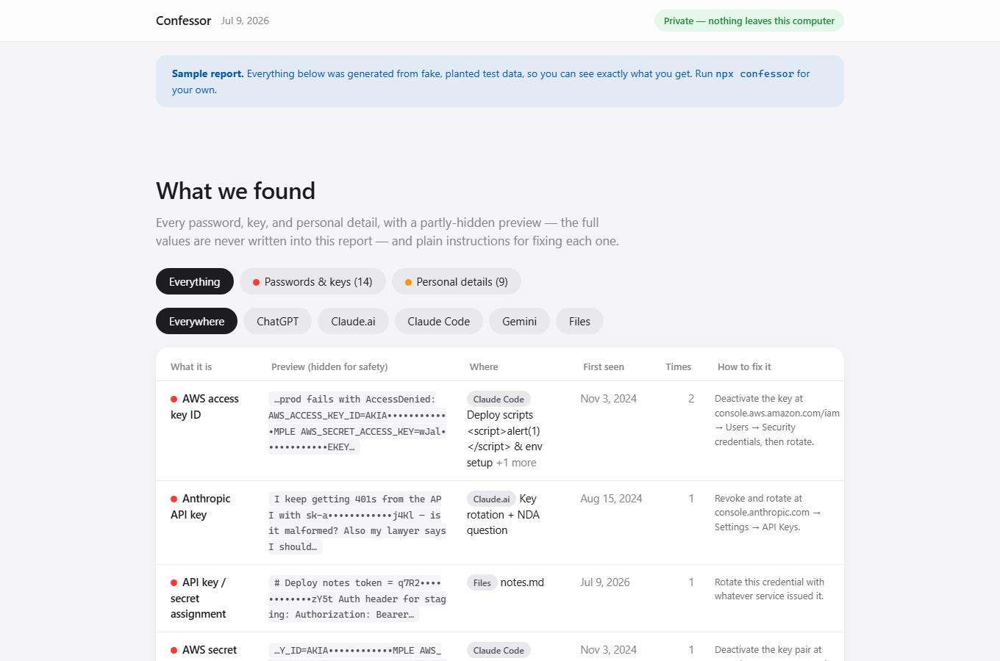
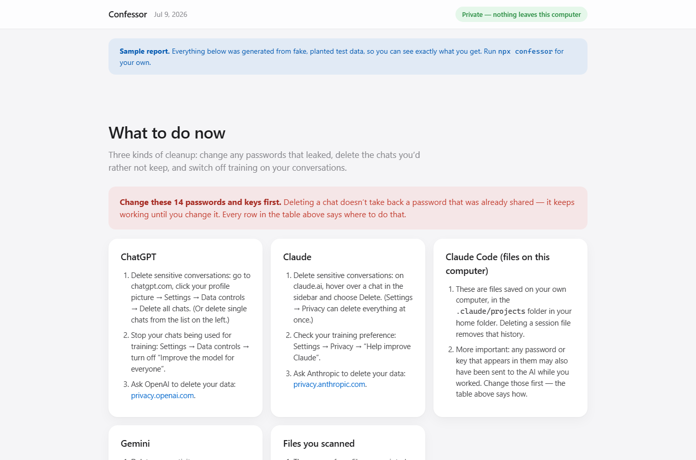

<div align="center">

# Confessor

*Find out what you've told AI.*


[](https://nodejs.org/)
[](package.json)
[](scripts/no-network-check.mjs)
[](https://github.com/ninjahawk/Confessor/actions/workflows/ci.yml)
[](https://github.com/ninjahawk/Confessor/actions/workflows/no-network.yml)
[](LICENSE)

**[View a sample report](https://ninjahawk.github.io/Confessor/)** · **[Quick start](#quick-start)** · **[The privacy guarantees](#the-privacy-guarantees)**

</div>

---

Confessor is a small command-line tool that scans your AI chat history and
shows you everything sensitive you've ever told it. Point it at a ChatGPT or
Claude export, your local Claude Code logs, or a Gemini Takeout, and it finds
the API keys you pasted at 2am, the phone numbers, the card numbers, the
salary negotiations, the medical questions, and the first time you introduced
yourself by name. Everything runs on your machine, the tool makes zero network
calls, and the output is one HTML file that works with the wifi off. I ran it
on my own logs and got an F, which is roughly why this exists.

The whole thing is about 3,800 lines of TypeScript with zero dependencies.
`npm install` downloads nothing except the tool itself, and there is no ML
anywhere — just 30 rules for secrets, 13 for personal identifiers, 7 topic
lexicons, and a scoring function you can read in ten seconds (critical ×10,
high ×3, medium ×1). Every finding is explainable by pointing at the one rule
that fired. This is a feature: a secret scanner that uploads your secrets, or
one whose behavior you can't audit, would be a punchline.

The report it produces is written for a normal person, not a security
engineer. Big grade up top, plain sentences ("We found 14 passwords or keys in
your AI conversations. They still work until you change them."), and concrete
instructions per service: what to rotate, what to delete, which settings turn
off training on your chats.

**1. Your grade.** One letter, three numbers, and the sentence that tells you
whether to worry. Plus a fact you probably didn't know, like the exact day you
first told Gemini your name.


**2. Every finding.** What it is, a partly-hidden preview (full values are
never written into the report — more on that below), where it happened, and
how to fix it. Pasting the same key fifty times counts once; the 50 shows up
in the "times" column.



**3. The cleanup.** Deleting a chat doesn't take back a key that already left
your machine, so the report ends with the part that actually matters: what to
rotate first, and the exact deletion / training-opt-out paths for each
provider.



## Quick start

You need Node ≥ 18.17. Then:

```bash
npx confessor
```

With no arguments it finds your local Claude Code logs (`~/.claude/projects`),
scans them, writes `confessor-report.html`, and opens it. For the chat
services, download your export first and point at it:

| Service | Where to get your data | Then |
|---|---|---|
| ChatGPT | chatgpt.com → Settings → Data controls → Export data | `npx confessor ~/Downloads/chatgpt-export.zip` |
| Claude | claude.ai → Settings → Privacy → Export data | `npx confessor ~/Downloads/claude-export.zip` |
| Gemini | takeout.google.com → select "My Activity" | `npx confessor ~/Downloads/Takeout` |
| anything else | any folder of `.txt .md .json .jsonl .log .csv` | `npx confessor ./notes` |

Useful flags: `--json` for machine-readable output, `--out <file>` to choose
the report path, `--no-open` to skip the browser, `--quiet`, and
`--fail-on critical|high|medium`, which exits with code 2 when findings hit
that severity — so you can drop it in CI and fail builds that contain secrets:

```bash
npx confessor ./docs --fail-on critical --no-open --quiet
```

There's also a programmatic API if you want the raw findings:
`import { audit, renderReport } from 'confessor'`.

## How it works

```
exports (.zip / folders / .jsonl / .html / .md / .json / .log / .csv)
    → adapters: ChatGPT · Claude · Claude Code · Gemini · generic text
    → detection, three layers per message:
        1. secrets   30 rules   sk-..., ghp_..., AKIA..., key blocks, DB URIs, JWTs,
                                password assignments
        2. PII       13 rules   emails, phones, SSNs, cards, IBANs, DOBs, addresses, IPs
        3. topics     7 lexicons  health, mental health, legal, money, work,
                                  relationships, identity
    → dedup + overlap resolution → score → one offline HTML file
```

Each rule is plain data: a regex, a cheap substring prefilter so the scan
stays fast, an optional context requirement (a bare 9-digit number only
counts as an SSN if something nearby says so), and a validator — Luhn for
cards, entropy and structure checks for tokens, so `sk-` appearing in prose
doesn't light up the report. The zip reader is written from scratch on
`node:zlib` because a dependency would break the zero-dependency guarantee,
and honestly it's not that much code.

Redaction is structural rather than best-effort. Every rule routes its match
through a redactor before anything is stored, and previews are scrubbed
against all findings in the message, so the preview for finding A can't leak
finding B sitting next to it.

## The privacy guarantees

The premise of the tool is that you don't fully trust software with this
data, and that should include this software. So the guarantees are enforced
by machinery, not promises:

1. **Zero network calls.** Nothing in `src/` may import a network-capable
   module or call `fetch`. A [static check](scripts/no-network-check.mjs)
   runs in CI on every commit and before every publish, and fails the build
   otherwise.
2. **Zero runtime dependencies.** Same check fails if `package.json` ever
   grows one. What you audit is this repo, full stop.
3. **Full values never appear in the report.** A test renders a report from
   fixtures full of planted secrets and asserts none of them appear in the
   output, character for character.
4. **The report works offline.** One file, no CDN, no fonts, no fetches. It
   ships with a CSP that blocks external loads even if something tried.

And if you don't want to take any of that on faith: run it with wifi off, or
read the source — it's short on purpose.

## Tests

`npm test` runs 60 tests: adapter round-trips for every supported format
(including a zipped ChatGPT export end-to-end), detection precision cases
(real keys flagged, look-alike prose not), the redaction guarantees above,
and the CI exit codes. The [hosted sample report](https://ninjahawk.github.io/Confessor/)
is generated from exactly these test fixtures, so what you see there is what
you get.

## Limitations

It's a rule engine, so you should know where the edges are. Structured
secrets and identifiers are caught well; a secret phrased in free prose with
no structure will slip through. The topic lexicons are English-only. Gemini's
Takeout format changes without notice, so that adapter is best-effort. And
the big one: Confessor tells you what left your machine, but nothing can
un-send it — rotating keys and deleting chats (the report walks you through
both) are the only real remedies.

False positives happen despite the validators. If you hit one, open an issue
— it's usually a one-line fix.

## License

MIT.
