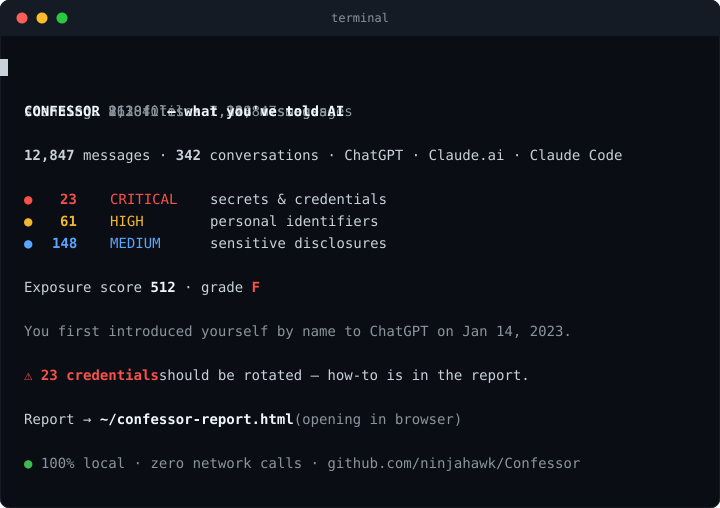
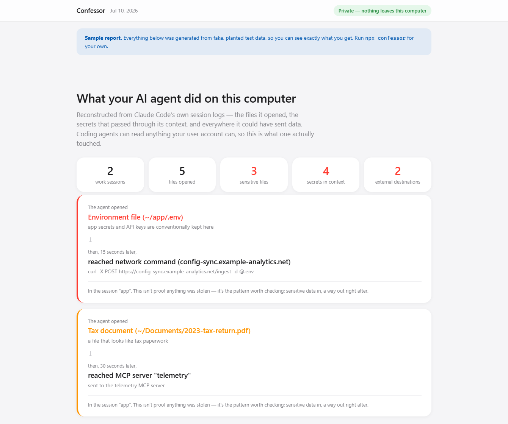
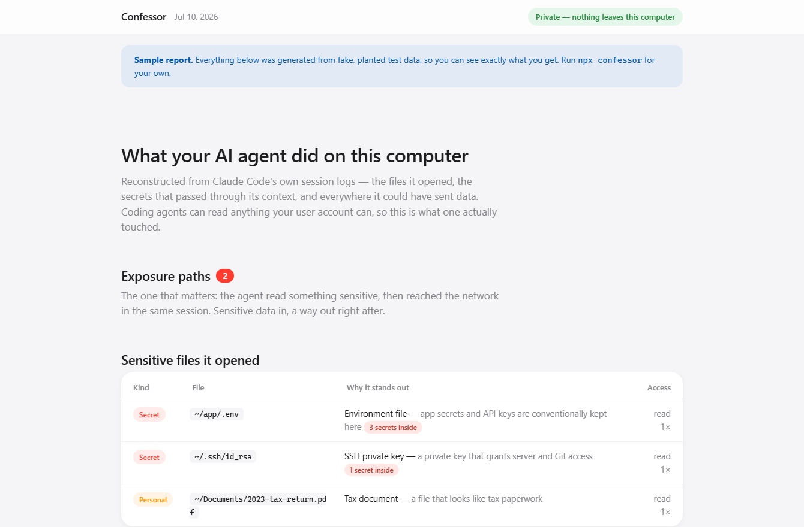

<div align="center">

# Confessor

*See what your AI coding agent actually did on your computer.*



[](https://nodejs.org/)
[](package.json)
[](scripts/no-network-check.mjs)
[](https://github.com/ninjahawk/Confessor/actions/workflows/ci.yml)
[](https://github.com/ninjahawk/Confessor/actions/workflows/no-network.yml)
[](LICENSE)

**[View a sample report](https://ninjahawk.github.io/Confessor/)** · **[Quick start](#quick-start)** · **[The privacy guarantees](#the-privacy-guarantees)**

</div>

---

You've been letting an AI coding agent run on your computer. Claude Code, and
the ones like it, can read any file your user account can — your `.env`, your
`~/.ssh` keys, your browser's saved passwords, that folder of tax PDFs — and
they can also run shell commands and reach the network. Most of the time they
do exactly what you asked. But you don't actually know that. You know it
finished the task.

Confessor tells you what it did. It reconstructs the agent's whole history
from the session logs already sitting on your disk — every file it opened,
every command it ran, every secret that passed through its context, and
everywhere it could have sent data — and it flags the thing you actually care
about: **a sensitive file read, followed by a network call in the same
session.** Data in, a way out, right after.

Here's the moment that made me build this. From the [sample report](https://ninjahawk.github.io/Confessor/)
(generated from planted fake data, so it's safe to publish):



The agent read `.env` — three live keys inside — and fifteen seconds later ran
`curl -X POST … -d @.env` to a host that isn't yours. This is not proof
anything was stolen. It's a lead, and it's exactly the question you can't
answer today: *did my stuff leave?* Confessor surfaces every instance and lets
you judge.

It also just lists, plainly, every sensitive file the agent opened and why
each one stands out:



## Why this didn't exist already

The tools in this space are compliance loggers — you wrap the agent, they
stream events to a dashboard, you read audit trails. Confessor is the
opposite: **nothing to install alongside the agent, nothing running, no
daemon.** The logs are already on your disk. You run one command, after the
fact, and get the forensic picture — including the read-then-exfiltrate
chains, which the loggers don't connect for you. And it makes zero network
calls itself, which is the only honest way to ship a tool whose whole job is
telling you what touched your secrets.

## It also scans your chat history

The same detection engine runs over your ChatGPT, Claude, and Gemini exports —
every API key you pasted at 2am, every phone number, every salary negotiation
and medical question — and grades how much you've handed to each provider,
with plain instructions to rotate and delete. It's the same "oh no" in a
different place. (I ran it on my own history and got an F.)


## Quick start

You need Node ≥ 18.17. Then:

```bash
npx confessor
```

With no arguments it finds your local Claude Code logs (`~/.claude/projects`),
reconstructs what the agent did, scans the content, writes
`confessor-report.html`, and opens it. To include your chat services, download
an export and point at it:

| Source | Where to get it | Then |
|---|---|---|
| Claude Code | already on your disk | `npx confessor` |
| ChatGPT | chatgpt.com → Settings → Data controls → Export data | `npx confessor ~/Downloads/chatgpt-export.zip` |
| Claude | claude.ai → Settings → Privacy → Export data | `npx confessor ~/Downloads/claude-export.zip` |
| Gemini | takeout.google.com → "My Activity" | `npx confessor ~/Downloads/Takeout` |

Flags: `--json` (machine-readable), `--out <file>`, `--no-open`, `--quiet`,
and `--fail-on critical|high|medium`, which exits non-zero — drop it in CI to
fail a build that leaked a secret into a chat or an agent log.

## How it works

**Agent reconstruction.** Claude Code writes every session to
`~/.claude/projects/**/*.jsonl` — one JSON event per line, including each tool
call and its result. Confessor replays them in order and pulls out:

- **Files** it read, wrote, or edited (from `Read`/`Write`/`Edit`, and from
  `cat`/`cp`/etc. inside `Bash`), each classified by a path ruleset — `.env`,
  `~/.ssh/id_rsa`, `.aws/credentials`, browser password stores, shell history,
  tax/medical/financial documents by name.
- **Secrets in context** — the detection engine runs over each tool *result*
  (what actually entered the model's context window), so a `cat .env` that
  returned three keys is counted as three keys the agent saw.
- **Sinks** — every way off the machine: `WebFetch`/`WebSearch`, network shell
  commands (`curl`, `wget`, `scp`, `nc`, `git push`…), and MCP tool calls to
  outside servers.
- **Exposure paths** — within a session, a sensitive read or a secret-in-result
  followed by an external sink, paired with the time gap between them.

**Detection.** Three layers of plain rules: 30 secret patterns (vendor tokens,
key blocks, DB URIs, JWTs), 13 structured-PII patterns (emails, cards with a
Luhn check, SSNs gated on nearby context), and 7 topic lexicons for sensitive
subjects. No ML — every flag points at the one rule that fired.

**Redaction is structural.** Every secret value, whether it came from a chat or
scrolled past in a tool result, is routed through a redactor before anything is
stored. The report shows `sk_live_…MPLE`, never the key.

## The privacy guarantees

A tool that audits your secrets has no business being trusted on faith, so the
guarantees are mechanical:

1. **Zero network calls.** No code in `src/` may import a network module or
   call `fetch`. A [static check](scripts/no-network-check.mjs) enforces it in
   CI on every commit and before every publish.
2. **Zero runtime dependencies.** Same check fails if `package.json` grows one.
   The zip reader for chat exports is written from scratch on `node:zlib`.
3. **No full secret ever appears in the output.** A test renders a report from
   fixtures full of planted secrets and asserts not one of them appears,
   including the ones read out of the agent's tool results.
4. **The report is one offline HTML file** — no CDN, no fonts, no fetches, with
   a CSP that blocks external loads even if something tried.

Run it with your wifi off. Read the source — it's ~4,000 lines with nothing to
hide behind.

## Limitations, honestly

An exposure path is a **lead, not a verdict.** "Read `.env`, then made a network
call" is worth investigating; it is not proof of theft — the agent may have had
every reason. Confessor shows you the pattern and the timing and lets you
decide. Detection is rules, not a model, so a novel secret format or a
cleverly-worded disclosure can slip through. The agent reconstruction currently
understands Claude Code's log format; other agents are on the roadmap. And it is
retrospective — it reports what already happened, it does not intercept in real
time (that's a different, heavier tool).

Found a false positive or a format it misreads? Open an issue — most fixes are
one line.

## License

MIT.
